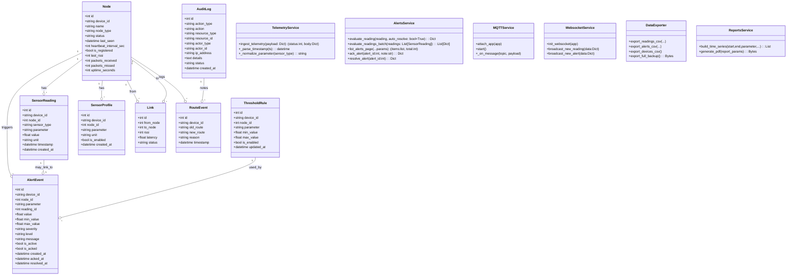
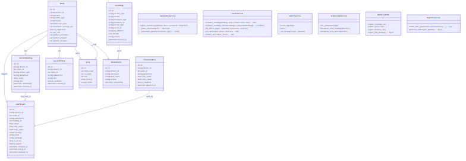
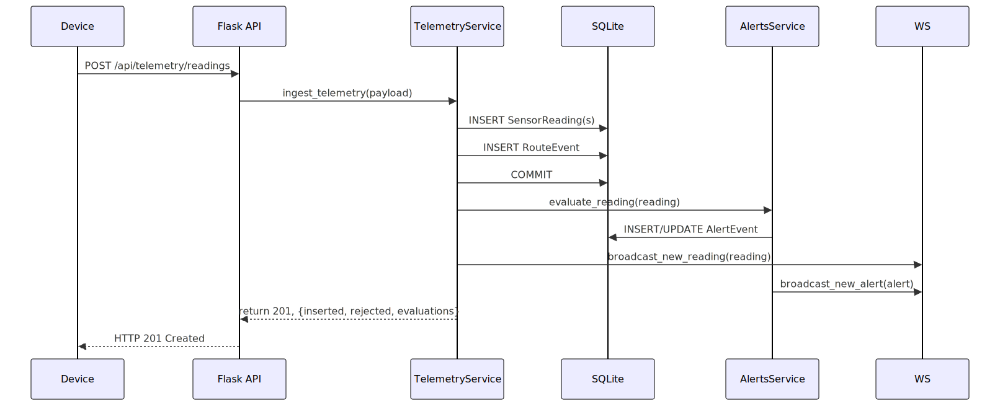
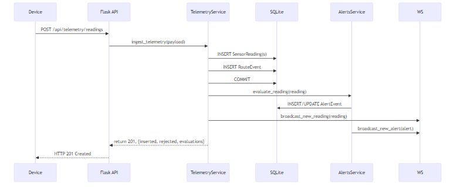
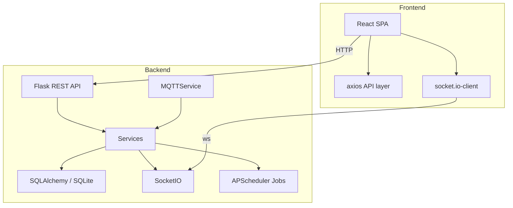
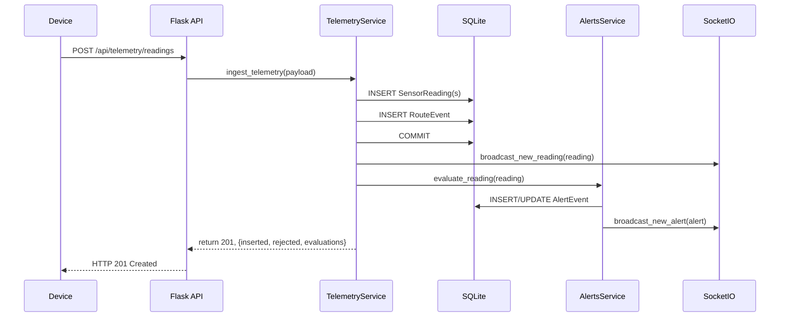
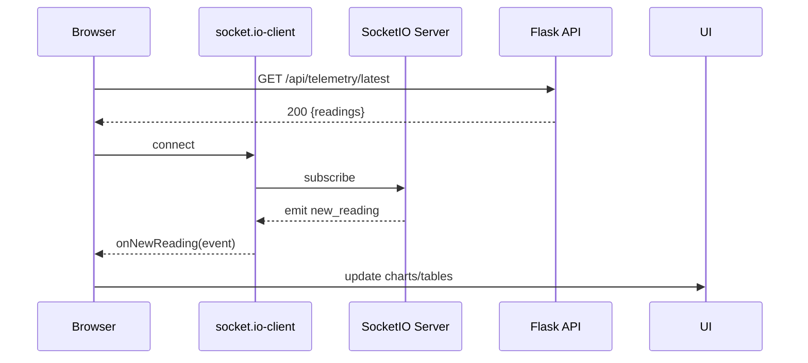

# Chapter 4 — System Analysis and Design

This chapter documents the system analysis and design for the "Smart Farm Network Management System" (NMS). It is written for a final‑year Computer Science audience and is comprehensive enough to allow a developer with no prior context to reconstruct the system.

---

## 4.5 UML Class Diagrams and Detailed Table Schemas

This section provides explicit class diagrams (Mermaid) and SQL table definitions for each major persistent entity so a developer can recreate the exact schema and understand field types, constraints and indexes.

### 4.5.1 Mermaid Class Diagram (UML-style)



### 4.5.2 Table-by-table SQL Definitions (SQLite dialect)

Below are explicit CREATE TABLE statements matching the SQLAlchemy models in `backend/app/models.py`. These are written for SQLite (used by default) but the field types are standard and portable.

1. `nodes` table

```sql
CREATE TABLE nodes (
  id INTEGER PRIMARY KEY AUTOINCREMENT,
  name TEXT NOT NULL,
  node_type TEXT,
  status TEXT DEFAULT 'online',
  device_id TEXT UNIQUE,
  ip_address TEXT,
  last_seen DATETIME,
  heartbeat_interval_sec INTEGER DEFAULT 30,
  is_registered BOOLEAN DEFAULT 0,
  last_rssi INTEGER,
  packets_received INTEGER DEFAULT 0,
  packets_missed INTEGER DEFAULT 0,
  uptime_seconds INTEGER DEFAULT 0
);
CREATE INDEX ix_nodes_device_id ON nodes(device_id);
```

### 4.5.5 Diagram source files and rendering

The mermaid source files for the diagrams have been saved to the repository under `diagrams/`:

- `diagrams/class_diagram.mmd` — detailed class diagram including service method signatures.
- `diagrams/telemetry_sequence.mmd` — sequence diagram for telemetry ingestion flow.

To render these to SVG or PNG locally you can use the `@mermaid-js/mermaid-cli` package. Example commands:

```bash
# install mermaid cli (node + npm required)
npm install -g @mermaid-js/mermaid-cli

# render SVG
mmdc -i diagrams/class_diagram.mmd -o diagrams/class_diagram.svg
mmdc -i diagrams/telemetry_sequence.mmd -o diagrams/telemetry_sequence.svg

# render PNG
mmdc -i diagrams/class_diagram.mmd -o diagrams/class_diagram.png
mmdc -i diagrams/telemetry_sequence.mmd -o diagrams/telemetry_sequence.png
```

Or use `npx` without global install:

```bash
npx @mermaid-js/mermaid-cli -i diagrams/class_diagram.mmd -o diagrams/class_diagram.svg
npx @mermaid-js/mermaid-cli -i diagrams/telemetry_sequence.mmd -o diagrams/telemetry_sequence.svg
```

Once rendered, include the generated SVG/PNG files in documentation exports or the dissertation appendix. The `.mmd` sources remain the single source of truth for diagram edits.

### Embedded diagrams

#### Class Diagram



_Fallback PNG:_



#### Telemetry Sequence Diagram



_Fallback PNG:_



2. `sensor_readings` table

```sql
CREATE TABLE sensor_readings (
  id INTEGER PRIMARY KEY AUTOINCREMENT,
  device_id TEXT NOT NULL,
  node_id INTEGER REFERENCES nodes(id),
  sensor_type TEXT NOT NULL,
  parameter TEXT NOT NULL,
  value REAL NOT NULL,
  unit TEXT,
  timestamp DATETIME NOT NULL DEFAULT (datetime('now')),
  created_at DATETIME NOT NULL DEFAULT (datetime('now'))
);
CREATE INDEX ix_readings_device_sensor_time ON sensor_readings(device_id, sensor_type, timestamp);
CREATE INDEX ix_readings_node_sensor_time ON sensor_readings(node_id, sensor_type, timestamp);
```

3. `threshold_rules` table

```sql
CREATE TABLE threshold_rules (
  id INTEGER PRIMARY KEY AUTOINCREMENT,
  device_id TEXT,
  node_id INTEGER,
  parameter TEXT NOT NULL,
  min_value REAL,
  max_value REAL,
  is_enabled BOOLEAN DEFAULT 1,
  updated_at DATETIME DEFAULT (datetime('now'))
);
CREATE INDEX ix_threshold_scope_param ON threshold_rules(device_id, node_id, parameter);
```

4. `alert_events` table

```sql
CREATE TABLE alert_events (
  id INTEGER PRIMARY KEY AUTOINCREMENT,
  device_id TEXT NOT NULL,
  node_id INTEGER,
  parameter TEXT NOT NULL,
  reading_id INTEGER REFERENCES sensor_readings(id),
  value REAL NOT NULL,
  min_value REAL,
  max_value REAL,
  severity TEXT NOT NULL,
  level TEXT NOT NULL DEFAULT 'WARNING',
  message TEXT NOT NULL,
  is_active BOOLEAN DEFAULT 1,
  created_at DATETIME NOT NULL DEFAULT (datetime('now')),
  is_acked BOOLEAN DEFAULT 0,
  acked_at DATETIME,
  resolved_at DATETIME,
  resolved_by_reading_id INTEGER
);
CREATE INDEX ix_alerts_device_param ON alert_events(device_id, parameter);
```

5. `sensor_profiles` table

```sql
CREATE TABLE sensor_profiles (
  id INTEGER PRIMARY KEY AUTOINCREMENT,
  device_id TEXT NOT NULL,
  node_id INTEGER,
  parameter TEXT NOT NULL,
  unit TEXT,
  is_enabled BOOLEAN DEFAULT 1,
  created_at DATETIME NOT NULL DEFAULT (datetime('now')),
  UNIQUE(device_id, node_id, parameter)
);
CREATE INDEX ix_sensor_profile_device_param ON sensor_profiles(device_id, parameter);
```

6. `links` table

```sql
CREATE TABLE links (
  id INTEGER PRIMARY KEY AUTOINCREMENT,
  from_node INTEGER REFERENCES nodes(id),
  to_node INTEGER REFERENCES nodes(id),
  rssi INTEGER,
  latency REAL,
  status TEXT DEFAULT 'up'
);
```

7. `route_events` table

```sql
CREATE TABLE route_events (
  id INTEGER PRIMARY KEY AUTOINCREMENT,
  device_id TEXT,
  old_route TEXT,
  new_route TEXT,
  reason TEXT,
  timestamp DATETIME DEFAULT (datetime('now'))
);
```

8. `audit_logs` table

```sql
CREATE TABLE audit_logs (
  id INTEGER PRIMARY KEY AUTOINCREMENT,
  action_type TEXT NOT NULL,
  action TEXT NOT NULL,
  resource_type TEXT NOT NULL,
  resource_id TEXT,
  actor_type TEXT DEFAULT 'system',
  actor_id TEXT,
  ip_address TEXT,
  user_agent TEXT,
  request_method TEXT,
  request_path TEXT,
  details TEXT,
  status TEXT DEFAULT 'success',
  error_message TEXT,
  created_at DATETIME DEFAULT (datetime('now')),
  duration_ms INTEGER
);
```

### 4.5.3 Indexing & Performance notes

- Keep the composite indexes as shown (`device_id, sensor_type, timestamp`) to optimize queries for latest readings and range queries used by the telemetry pages and reports.
- Use `LIMIT` and `OFFSET` for paging large result sets; the `alerts_service.list_alerts_page` uses these patterns to avoid large memory usage.
- When migrating to a heavier RDBMS (Postgres/MySQL), convert `datetime('now')` defaults to the DB-specific functions and add appropriate connection pool tuning.

### 4.5.4 Sample queries

- Latest readings per device (SQL):

```sql
SELECT device_id, sensor_type, value, timestamp
FROM sensor_readings
WHERE device_id = 'ESP32_01'
ORDER BY timestamp DESC
LIMIT 100;
```

- Active alerts (page):

```sql
SELECT * FROM alert_events
WHERE is_active = 1
ORDER BY created_at DESC
LIMIT 50 OFFSET 0;
```

---

_End of Chapter 4._
**Contents**

- 4.1 Overview
- 4.2 Systems Analysis
  - 4.2.1 Objectives & Scope
  - 4.2.2 Functional Requirements
  - 4.2.3 Non‑Functional Requirements
  - 4.2.4 Actors and Use Cases
  - 4.2.5 Data Flow and Process Descriptions
- 4.3 System Design
  - 4.3.1 Software Architecture (high level)
  - 4.3.2 Component Decomposition and Module Responsibilities
  - 4.3.3 Data Model & Database Design (ERD + table details)
  - 4.3.4 Sequence Diagrams (critical flows)
  - 4.3.5 API Contracts & Route Mapping
  - 4.3.6 User Interface Design
  - 4.3.7 Deployment & Offline Operation
  - 4.3.8 Security, Logging and Error Handling
- 4.4 Summary

---

## 4.1 Overview

This system provides an offline‑first Network Management System for IoT‑enabled smart farming. The NMS collects telemetry from field devices (ESP32/Arduino), stores data locally, evaluates thresholds to raise alerts, supports predictive analytics, and exposes an interactive dashboard for farm operators. The design favours simplicity and low resource usage so it can run on a single board computer (e.g. Raspberry Pi) or a modest server in rural environments.

Files referenced in this chapter are available in the project tree; primary backend entry points include [backend/run.py](backend/run.py) and [backend/app/**init**.py](backend/app/__init__.py). Frontend entry points include [frontend/src/main.tsx](frontend/src/main.tsx) and [frontend/src/App.tsx](frontend/src/App.tsx).

## 4.2 Systems Analysis

### 4.2.1 Objectives & Scope

Primary aim: Design and implement a local Network Management System for smart farming which:

- Collects sensor telemetry from heterogeneous IoT devices (HTTP and MQTT).
- Stores telemetry locally and allows historical queries and reports.
- Provides real‑time UI updates via WebSockets (Socket.IO) without internet.
- Evaluates thresholds, generates alerts (create/ack/resolve) and supports scheduled predictive tasks.
- Exports data for offline sharing (CSV, ZIP backups, PDF reports).

Out of scope: large commercial scale horizontal scaling, high‑security hardened multi‑tenant setups, custom hardware design beyond commodity IoT devices.

### 4.2.2 Functional Requirements

1. Device Registration: devices must register with a unique `device_id` via `/api/devices/register` (see [backend/app/routes/devices.py](backend/app/routes/devices.py)).
2. Telemetry Ingestion (HTTP): Accept single or batch payloads at `/api/telemetry/readings` (see [backend/app/routes/telemetry.py](backend/app/routes/telemetry.py)).
3. Telemetry Ingestion (MQTT): Subscribe to `nms/telemetry/#` on a local MQTT broker and ingest messages through the same service layer (`app/services/mqtt_service.py`).
4. Storage: Persist readings, nodes, links, thresholds, alerts and audit logs in a local SQLite DB (models in [backend/app/models.py](backend/app/models.py)).
5. Alerting: Evaluate readings against `ThresholdRule` and persist `AlertEvent` (logic in [backend/app/services/alerts_service.py](backend/app/services/alerts_service.py)).
6. Real‑time updates: Broadcast new readings and alerts to connected clients via Socket.IO (implementation in [backend/app/services/websocket_service.py](backend/app/services/websocket_service.py)).
7. Dashboard: Frontend displays pages for telemetry, alerts, topology, reports and settings (see `frontend/src/pages/*`).
8. Reporting & Export: Generate JSON/CSV/PDF reports and full ZIP backups via services in [backend/app/services/data_export_service.py](backend/app/services/data_export_service.py) and [backend/app/services/pdf_report.py](backend/app/services/pdf_report.py).
9. Scheduler jobs: Periodic tasks for re‑evaluation and predictive analysis scheduled with APScheduler (configured in [backend/app/**init**.py](backend/app/__init__.py)).

### 4.2.3 Non‑Functional Requirements

- Offline operation: system must work end‑to‑end without internet; all services should be local.
- Lightweight: must run on low‑resource hardware (Raspberry Pi class) using Python + SQLite and a minimal Node build for frontend.
- Extensible: modular service architecture to add new sensors/parameters.
- Reliable: use DB transactions and scheduled jobs to ensure eventual consistency.
- Usable: the web dashboard should be intuitive for non‑technical operators.

### 4.2.4 Actors and Use Cases

Primary actors:

- Farmer / Operator (uses dashboard)
- Edge IoT Device (ESP32, Arduino) – produces telemetry and optionally heartbeats
- System Administrator – configures thresholds, exports/imports backups
- Background Scheduler – triggers predictive analysis and maintenance jobs

Representative use cases (brief):

1. Register Device
   - Actor: Device or Admin via UI
   - Precondition: network reachable between device and server (local network)
   - Flow: POST `/api/devices/register` → persist Node → RouteEvent → AuditLog → respond 201/200
   - Postcondition: node is marked `is_registered = True`

2. Send Telemetry (HTTP)
   - Actor: Device
   - Flow: POST `/api/telemetry/readings` → validate payload → write SensorReading(s) → RouteEvent → commit → broadcast event → run `evaluate_reading` → respond 201

3. Send Telemetry (MQTT)
   - Actor: Device
   - Flow: Publish to `nms/telemetry/<device_id>` → `MQTTService` receives → forwards to `ingest_telemetry` → same path as HTTP ingestion.

4. View Dashboard
   - Actor: Operator (browser)
   - Flow: Browser loads SPA → `GET /api/alerts/summary`, `GET /api/telemetry/latest`, `GET /api/network/health` → render cards and charts → subscribe to Socket.IO for live updates

5. Generate Report
   - Actor: Operator
   - Flow: Request report parameters → `GET /api/reports/*` or POST to PDF endpoint → `reports_service` builds aggregated data → returns JSON or PDF → browser triggers download

### 4.2.5 Data Flow and Process Descriptions

High level data flow:

- Devices → (HTTP/MQTT) → Ingestion Service → Database (SensorReading, Node) → Alerting Service → AlertEvent → WebSocket broadcasts → Frontend UI

A simplified flow diagram (mermaid):

```mermaid
flowchart LR
  Device[IoT Device] -->|HTTP POST| API[/api/telemetry/readings]
  Device -->|MQTT publish| MQTT[Local MQTT Broker]
  MQTT -->|MQTTService subscribes| BackendIngest[Telemetry Ingest Service]
  API --> BackendIngest
  BackendIngest --> DB[(SQLite Database)]
  BackendIngest --> WS[Socket.IO Broadcast]
  BackendIngest --> Alerts[Alerts Service]
  Alerts --> DB
  Alerts --> WS
  Frontend -->|HTTP| API
  Frontend -->|Socket.IO| WS
```

## 4.3 System Design

### 4.3.1 Software Architecture (high level)

The system follows a layered, modular architecture with clear separation of concerns:

- Transport Layer: HTTP REST endpoints (Flask) and MQTT subscription (paho/mqtt wrapper). Files: [backend/app/routes/\*](backend/app/routes) and [backend/app/services/mqtt_service.py](backend/app/services/mqtt_service.py).
- Service Layer: Business logic with domain‑specific services (telemetry ingestion, alert evaluation, reporting). Files: [backend/app/services/\*.py](backend/app/services).
- Persistence Layer: SQLAlchemy ORM models and migrations. Files: [backend/app/models.py](backend/app/models.py) and migration scripts under `app/scripts`.
- Real‑time Layer: Socket.IO server and emitter utilities. Files: [backend/app/services/websocket_service.py](backend/app/services/websocket_service.py).
- Presentation Layer: React SPA built with Vite (`frontend/src/*`).

Architectural diagram (mermaid):



### 4.3.2 Component Decomposition and Module Responsibilities

Key backend modules and responsibilities:

- `app/__init__.py` — application factory, extension initialization, scheduler setup, MQTT client attachment and startup; registers all blueprints.
- `app/models.py` — database schema (see 4.3.3 for explicit table definitions).
- `app/routes/*` — HTTP to service mapping.
- `app/services/telemetry.py` — central ingestion logic. Validates device registrations, normalises parameters, inserts `SensorReading`, creates `RouteEvent`, commits and broadcasts, then triggers alert evaluation.
- `app/services/alerts_service.py` — threshold resolution, dedupe logic, create/update `AlertEvent`, auto‑resolve rules, paging helpers.
- `app/services/mqtt_service.py` — subscribes to `nms/telemetry/#` and forwards payloads to the same ingestion function the REST endpoints call.
- `app/services/data_export_service.py` — CSV/ZIP/PDF export and import logic.
- `app/services/predictive_analytics_service.py` — forecasting and predictive alert creation.
- `app/services/websocket_service.py` — initializes `socketio` and provides `broadcast_new_reading` / `broadcast_new_alert` helpers.

Key frontend modules and responsibilities:

- `frontend/src/api/*` — typed axios wrappers mapping to backend routes.
- `frontend/src/realtime/socket.ts` — socket.io client; reconnect logic and event mapping.
- `frontend/src/pages/*` — route views composing components and performing the necessary API calls.
- `frontend/src/components/*` — presentational and container components for UI features.

### 4.3.3 Data Model & Database Design (ERD + table details)

Below is an Entity Relationship Diagram (ERD) showing major entities and relationships expressed in Mermaid syntax.

```mermaid
erDiagram
  NODE ||--o{ SENSOR_READING : has
  NODE ||--o{ SENSOR_PROFILE : has
  NODE ||--o{ ALERT_EVENT : triggers
  SENSOR_READING }o--|| ALERT_EVENT : may_link_to
  NODE ||--o{ LINK : from
  NODE ||--o{ LINK : to
  ROUTE_EVENT }o--|| NODE : relates_to
  THRESHOLD_RULE ||--o{ ALERT_EVENT : uses
  AUDIT_LOG ||--o{ ROUTE_EVENT : logs

  NODE {
    int id PK
    string device_id
    string name
    string node_type
    string status
    datetime last_seen
    int heartbeat_interval_sec
    bool is_registered
    int last_rssi
    int packets_received
    int packets_missed
    int uptime_seconds
  }

  SENSOR_READING {
    int id PK
    string device_id
    int node_id FK
    string sensor_type
    float value
    string unit
    string parameter
    datetime timestamp
    datetime created_at
  }

  ALERT_EVENT {
    int id PK
    string device_id
    int node_id
    string parameter
    int reading_id FK
    float value
    float min_value
    float max_value
    string severity
    string level
    string message
    bool is_active
    datetime created_at
    bool is_acked
    datetime acked_at
    datetime resolved_at
  }

  THRESHOLD_RULE {
    int id PK
    string device_id
    int node_id
    string parameter
    float min_value
    float max_value
    bool is_enabled
  }

  SENSOR_PROFILE {
    int id PK
    string device_id
    int node_id
    string parameter
    string unit
    bool is_enabled
  }

  LINK {
    int id PK
    int from_node FK
    int to_node FK
    int rssi
    float latency
    string status
  }

  ROUTE_EVENT {
    int id PK
    string device_id
    string old_route
    string new_route
    string reason
    datetime timestamp
  }

  AUDIT_LOG {
    int id PK
    string action_type
    string action
    string resource_type
    string resource_id
    string actor_type
    string actor_id
    string ip_address
    text details
    datetime created_at
  }
```

Detailed table fields are implemented in [backend/app/models.py](backend/app/models.py). When reconstructing the system, ensure that the SQLAlchemy models are created with the same column names, types and indexes to preserve query performance and compatibility.

Normalization: Data is normalized to avoid duplication — devices (Node) are separate from readings (SensorReading); threshold rules are scoped to device/node/parameter enabling override semantics.

### 4.3.4 Sequence Diagrams (critical flows)

1. Telemetry ingestion (HTTP or MQTT):



2. Frontend real‑time flow:



### 4.3.5 API Contracts & Route Mapping

Key API endpoints and their mapping to backend code (non‑exhaustive):

- Device management
  - `GET /api/devices` → [backend/app/routes/devices.py](backend/app/routes/devices.py) `list_devices()`
  - `POST /api/devices/register` → `register_device()`
  - `POST /api/devices/heartbeat` → `device_heartbeat()`

- Telemetry
  - `POST /api/telemetry/readings` → [backend/app/routes/telemetry.py](backend/app/routes/telemetry.py) → `ingest_telemetry` in [backend/app/services/telemetry.py](backend/app/services/telemetry.py)
  - `GET /api/telemetry/latest` → [backend/app/routes/telemetry_queries.py](backend/app/routes/telemetry_queries.py)
  - `GET /api/telemetry/range` → `telemetry_range()` → aggregation helpers in [backend/app/services/telemetry_queries.py](backend/app/services/telemetry_queries.py)

- Alerts
  - `GET /api/alerts` → `list_alerts_page` in [backend/app/services/alerts_service.py](backend/app/services/alerts_service.py)
  - `POST /api/alerts/<id>/ack` → `ack_alert()`
  - `POST /api/alerts/<id>/resolve` → `resolve_alert()`

- Reports & Exports
  - `GET /api/reports/*` → [backend/app/routes/reports.py](backend/app/routes/reports.py) and [backend/app/services/reports_service.py](backend/app/services/reports_service.py)
  - `GET /api/data-export/full-backup` → `DataExporter.export_full_backup()` in [backend/app/services/data_export_service.py](backend/app/services/data_export_service.py)

- Realtime
  - Socket namespace `/ws` handlers in [backend/app/routes/websocket.py](backend/app/routes/websocket.py) and emitter helpers in [backend/app/services/websocket_service.py](backend/app/services/websocket_service.py)

When re‑implementing the frontend, ensure the axios wrappers in `frontend/src/api/*` match the exact parameter names and response shapes the backend returns (see `api_docs.py` for documented models and examples: [backend/app/api_docs.py](backend/app/api_docs.py)).

### 4.3.6 User Interface Design

Design goals:

- Minimal training required for operators.
- Prominent alert indicator for critical events.
- Historical telemetry charts (per parameter) and an interactive topology map.

Suggested page/components mapping (matches project):

- Dashboard
  - KPI Cards (`/api/alerts/summary`, `/api/network/health`)
  - Recent Incidents feed (socket subscription)
  - Worst nodes table
- Alerts
  - Inbox table with filters (device, parameter, severity)
  - Alert details drawer (ack/resolve controls)
- Telemetry
  - Time range selector
  - Parameter selector
  - Time series chart with live update
- Reports
  - Report builder UI (start/end, device, parameters)
  - Download buttons for JSON/CSV/PDF

UI wireframes can be simple HTML mockups; the repository's `frontend/src/components/*` contains the actual React implementations. For inclusion in the final report, export the key screens as image assets (or include screenshots) and attach in appendices.

### 4.3.7 Deployment & Offline Operation

Software stack & versions (recommendation):

- Python 3.10+
- Flask 2.x, Flask‑SocketIO 5.x
- SQLAlchemy 1.4+
- APScheduler 3.x
- Mosquitto MQTT broker (or Docker image: `eclipse-mosquitto`)
- Node.js 16+ and npm

Recommended deployment steps (local machine / Raspberry Pi):

1. Backend setup (Windows example commands):

```powershell
cd backend
python -m venv venv
venv\Scripts\activate
pip install -r requirements.txt
# Create DB if not present (app creates tables automatically on startup)
python run.py
```

2. Frontend setup:

```bash
cd frontend
npm install
npm run dev   # development
# or
npm run build # produce dist/
```

3. MQTT broker (local):

```bash
# If mosquitto installed locally
mosquitto -v
# Or run Docker container
docker run -it -p 1883:1883 eclipse-mosquitto
```

4. Start the system:

- Start MQTT broker.
- Start backend `python run.py` (this will attach MQTT client and scheduler).
- Start frontend dev server if developing or serve built `dist` using a static server.

Offline operation notes:

- All components are local: the browser connects to Flask (via `http://localhost:5000` or the machine's LAN IP) while IoT devices connect via the same LAN or direct USB/Ethernet to the MQTT broker on the same host. No external network is required.
- The entire stack can run on a single Raspberry Pi, laptop, or small server. For field deployments, pair the host with a Wi‑Fi access point to which devices attach; the front end can then be opened in a tablet or smartphone on the same network.
- Data export (CSV/ZIP/PDF) allows physical transfer via USB flash drives or SD cards — essential in areas with no connectivity. The `DataExporter.export_full_backup()` returns a ZIP suitable for backup/restore.
- Scheduler jobs (alert re‑evaluation, predictive analytics) execute entirely within the host; they do not require internet and automatically start when the backend starts. You can disable the scheduler by setting `ENABLE_SCHEDULER=false` in environment variables.
- For headless operation, run the Flask backend as a system service or use `gunicorn` behind nginx; the frontend can be served by nginx from `frontend/dist`.

#### Example network layout

```
[ESP32 sensors] --(WiFi/LoRaWAN)--+        +--[Tablet running browser]
                                   |        |
[MQTT Gateway / Router]-----------+-- [Host/RPi running Backend & Broker]
                                   |
[Optional GSM dongle for occasional sync]
```

The host provides DHCP and DNS or static IPs; devices push telemetry over HTTP or MQTT to the broker. The browser is generally local but can access the host by IP if on the same network.

#### Running as a background service

On Linux (Raspberry Pi) you may create a `systemd` unit:

```ini
[Unit]
Description=Smart Farm NMS Backend
After=network.target mosquitto.service

[Service]
User=pi
WorkingDirectory=/home/pi/Network\ Management\ System/backend
Environment="FLASK_APP=run.py"
Environment="FLASK_ENV=production"
ExecStart=/home/pi/Network\ Management\ System/backend/venv/bin/python -m flask run --host=0.0.0.0 --port=5000
Restart=always

[Install]
WantedBy=multi-user.target
```

Then enable and start with:

```bash
sudo systemctl enable nms-backend.service
sudo systemctl start nms-backend.service
```

The MQTT broker (e.g. Mosquitto) should also be configured to start automatically.

#### Power considerations

- Use a DC power supply or rechargeable battery pack for the host. Raspberry Pi can be powered by 5 V USB; add a UPS HAT or small solar panel and battery for resilience.
- IoT devices should be battery or solar powered; the system does not manage power directly but low‑power firmware (deep sleep between transmissions) is advisable.

#### Troubleshooting tips

- If the frontend cannot reach the backend, open a browser on the host and navigate to `http://localhost:5000/api/health`. Ensure CORS is enabled (it is by default for `/api/*`).
- Check `app/logs` (create directory if necessary) or run `python run.py` in a console to view logs.
- Use `mosquitto_sub -h localhost -t "nms/telemetry/#" -v` to confirm MQTT messages are received by the broker.

With these notes, deployment instructions are comprehensive for rural/offline installations.

### 4.3.8 Security, Logging and Error Handling

- Authentication is minimal in the base version. For production, add token‑based auth (JWT) and secure sockets (HTTPS). See `api_docs.py` which includes a placeholder for `Bearer Auth` in the docs.
- Audit logging: operations are recorded in `AuditLog` for traceability.
- Error handling: API routes wrap calls and return standard 4xx/5xx responses and include basic server error handlers (see `app/__init__.py`).

## 4.4 Summary

This chapter provided a complete system analysis and design for the Smart Farm NMS. It documented functional and non‑functional requirements, use cases, data flows, a layered software architecture, component responsibilities, database schema, sequence diagrams for critical flows, API routes, UI mapping, deployment guides and offline operation best practices.

Using this chapter together with the code in the repository, a competent developer should be able to re‑implement or extend the system, deploy it to local hardware and operate it in environments without internet connectivity.

---

_End of Chapter 4._
